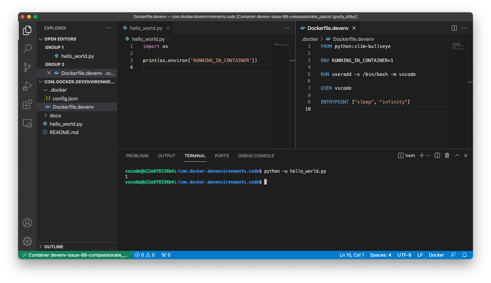
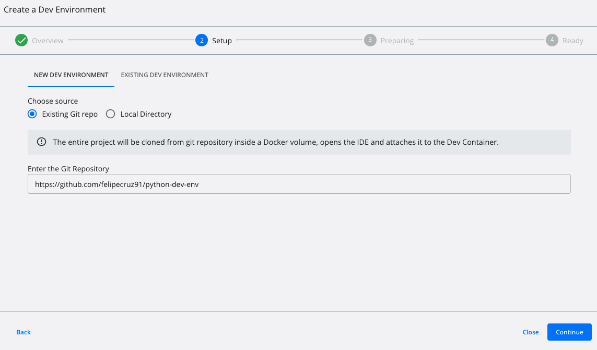

# python-dev-env

This is an example of a Python-based Docker Dev Environment that shows how to set environment variables with regards this [issue](https://github.com/docker/dev-environments/issues/88).



## Getting started

Open Docker Desktop and create a Dev Environment from `https://github.com/felipecruz91/python-dev-env`



Clikc on `Open in VSCode` and run the python script within the dev container:

```cli
python -u hello_world.py
```

The script will print the value of the environment variable `RUNNING_IN_CONTAINER`.

The output should be `1` as it is the value set in the [Dockerfile.devenv](.docker/Dockerfile.devenv#L3)
